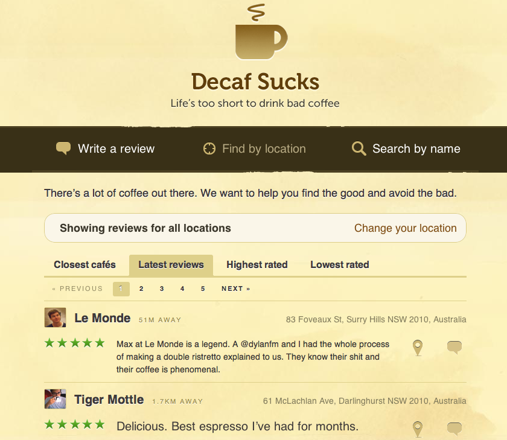
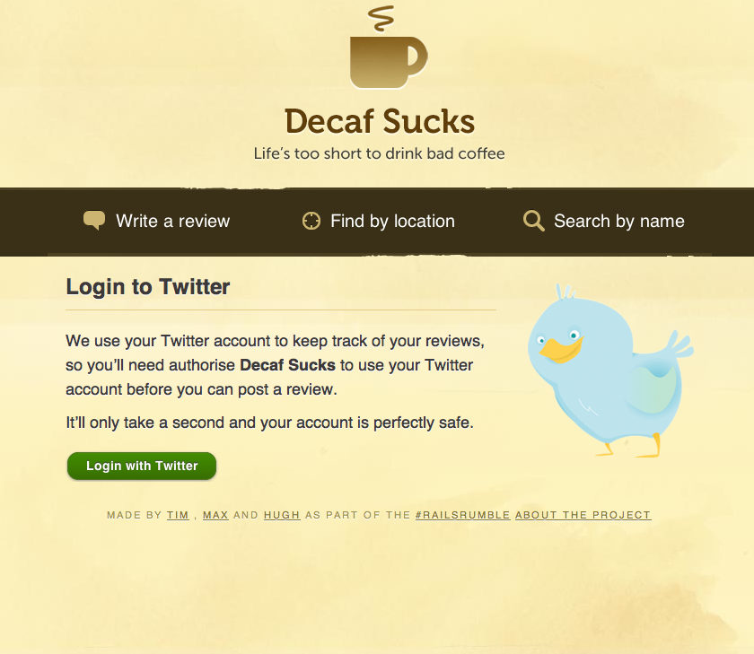

!SLIDE nologo

# Facebook & OAuth 2.0

## Tim Riley

### @timriley • **openmonkey**.com • **icelab**.com.au

!SLIDE bullets center centerbullets

* An open standard for API access delegation

!SLIDE bullets incremental

# Why external authentication?

!SLIDE center nologo

!SLIDE bullets incremental

# I'm a slow learner.

## Rails Rumble

* 2007 - RESTful Authentication
* 2008 - OpenID
* 2009 - Twitter Auth

!SLIDE nologo center transition=scrollUp

!SLIDE nologo center transition=fade

!SLIDE bullets centerbullets transition=scrollUp

# Previously...

* Twitter & OAuth 1.0
* Facebook Connect

!SLIDE bullets centerbullets

# Facebook Graph API

* Launched April 2010
* RESTful
* JSON
* OAuth 2.0

!SLIDE center

!SLIDE command transition=toss

# gem install oauth2

!SLIDE command

# ./script/generate controller oauth

!SLIDE code small

	@@@ ruby
	map.oauth_authorize '/oauth/start',
	  :controller => 'oauth',
	  :action     => 'start'
	  
	map.oauth_callback  '/oauth/callback',
	  :controller => 'oauth',
	  :action     => 'callback'
  
!SLIDE code small

	@@@ ruby
	class OauthController < ApplicationController
	
	  def start
	    redirect_to client.web_server.authorize_url(
	      :redirect_uri => oauth_callback_url
	    )
	  end
	
	end
	
!SLIDE code small

	@@@ ruby
	class OauthController < ApplicationController

	  protected
	
	  def client
	    @client ||= OAuth2::Client.new(
	      'app_id',
	      'app_secret',
	      :site => 'https://graph.facebook.com'
	    )
	  end
	
	end

!SLIDE code small

	@@@ ruby
	class OauthController < ApplicationController
	
	  def callback
	    access_token = client.web_server.get_access_token(
	      params[:code],
	      :redirect_uri => oauth_callback_url
	    )
  
	    user_json = access_token.get('/me')
	    render :json => user_json
	  end
	
	end
	
!SLIDE code small

	@@@ javascript
	{
	   "id": "123456789",
	   "name": "Tim Riley",
	   "first_name": "Tim",
	   "last_name": "Riley",
	   "link": "http://www.facebook.com/tariley",
	   "gender": "male"
	}
	
!SLIDE code smaller

	@@@ ruby
	class OauthController < ApplicationController
	
	  def callback
	    access_token = client.web_server.get_access_token(
	      params[:code],
	      :redirect_uri => oauth_callback_url
	    )
    
	    @user = User.identify_or_create_from_access_token(
	      access_token
	    )
	    
	    session[:user_id] = @user.id
	    flash[:notice]    = "Logged in!"
	    
	    redirect_back_or_default(root_path)
	  end
	
	end

!SLIDE code smaller

	@@@ ruby
	class User < ActiveRecord::Base
	
	  def self.identify_or_create_from_access_token(access_token)
	    user_info = JSON.parse(access_token.get('/me'))
	
	    user = find_by_account_id(user_info['id']) || new
	    user.assign_user_info(user_info)
	    user.save
	    user
	  end
	
	end
	
!SLIDE code smaller

	@@@ ruby
	class User < ActiveRecord::Base
	
	  def assign_user_info(user_info)
	    self.account_id  = user_info['id']
	    self.account_url = user_info['link']
	    self.name        = user_info['name']
	    self.first_name  = user_info['first_name']
	  end

	end

!SLIDE transition=toss

# Demo

!SLIDE bullets centerbullets

# Thanks!

* graph.facebook.com
* github/intridea/oauth2
* github.com/timriley/roro-facebook-oauth
